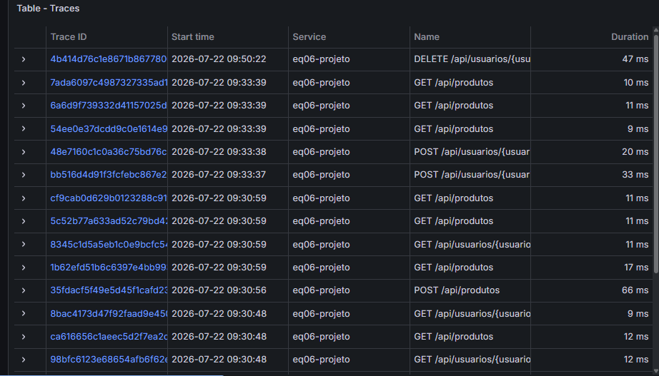
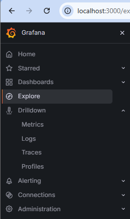
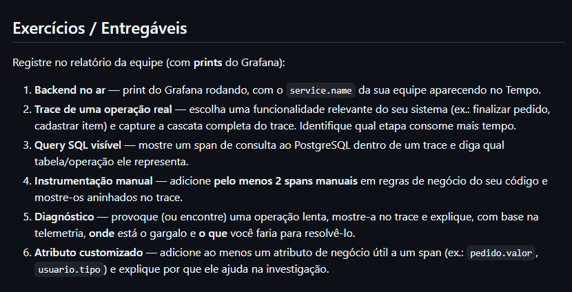
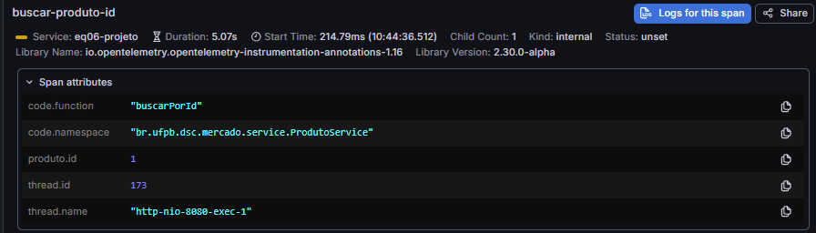

# Relatório de Implementação: Observabilidade (Equipe 06)

**Equipe:** 06
**Projeto:** Mercado

Este relatório descreve o processo de instrumentação da nossa aplicação Spring Boot utilizando a stack do OpenTelemetry conectada ao Grafana (LGTM).

---

## 1. Backend no ar

O nosso serviço foi instrumentado utilizando o agente nativo do OpenTelemetry para a JVM e configurado no `docker-compose.dev.yml` para enviar as requisições, através do protocolo OTLP, para o container `otel-lgtm`. 

O nome do nosso serviço foi definido como `eq06-projeto`.

> **[]**

A imagem acima demonstra a interface do Grafana (Tempo) listando com sucesso os traces recebidos do nosso backend (como requisições `GET /api/produtos` e `POST /api/usuarios`), comprovando que o agente está capturando e enviando a telemetria corretamente.

---

## 2. Trace de uma operação real

Abaixo demonstramos a cascata completa de rastreamento para a operação de Cadastro de um Produto.

> **[]**

**Análise do consumo de tempo:**
Observando o trace da requisição `POST /api/produtos`, que teve uma duração total de 66.25ms, notamos que a etapa que consome a maior parte desse tempo é a regra de negócio do serviço `criar-produto` (11.54ms) juntamente com as operações de banco de dados anexas a ele, como o commit da transação e a inserção no log de auditoria. O restante do tempo (a diferença entre 66ms e 11ms) é consumido pela própria infraestrutura do framework Spring Web (Tomcat, filtros, serialização de JSON).

---

## 3. Query SQL visível

Como o Agente Java do OpenTelemetry já possui instrumentação automática para drivers JDBC, ele intercepta nossa comunicação com o PostgreSQL e transforma as chamadas do Spring Data JPA em Spans visíveis.

> **[]**

Na árvore de execução, podemos observar o span `INSERT mercado_dev.produto`, que durou 2.55ms, além do span `INSERT mercado_dev.audit_log`. Estes spans representam as instruções SQL reais geradas pelo framework Hibernate para persistir o novo produto e o respectivo log de auditoria na tabela do banco de dados PostgreSQL (`mercado_dev`).

---

## 4. Instrumentação manual

Para além das requisições web capturadas automaticamente, criamos marcações de rastreamento de negócio para entender quanto tempo o código da nossa classe de serviço (`ProdutoService`) demora para ser executado de forma isolada, independentemente do tempo de rede ou do framework.

Utilizamos as anotações nativas da API do OpenTelemetry (`@WithSpan`):

> **[]**

Como evidenciado na imagem, o span manual `criar-produto` aparece perfeitamente aninhado dentro da execução da requisição principal. Essa instrumentação manual nos permite isolar a regra de negócio exata (que neste caso levou 11.54ms).

---

## 5. Diagnóstico

Para evidenciar o poder da telemetria, provocamos um atraso sistêmico inserindo um gargalo artificial no código do serviço `ProdutoService` (um bloqueio síncrono de 5 segundos no método de busca por ID).

> **[]**

**Explicação baseada na Telemetria:**
Sem a telemetria, notaríamos apenas que o endpoint da API demorou longos 5.33 segundos, e a culpa poderia recair equivocadamente sobre a rede ou lentidão no banco de dados. 
Com o trace no Grafana, vemos imediatamente que o gargalo ocorreu *exatamente* dentro do span da nossa regra de negócio `buscar-produto-id`, que tomou 5.07s de forma bloqueante (visto que a query do banco `findById` levou apenas 70.97ms do total). 

**Como resolver:**
Na vida real, ao diagnosticar que um método de busca consome tanto tempo computacional ou sofre gargalos I/O crônicos que não são do banco, a solução seria introduzir uma camada de Cache (`Redis` ou o `@Cacheable` nativo do Spring). Assim, as requisições subsequentes ao mesmo produto retornariam em menos de 10ms, evitando executar o método pesado.

---

## 6. Atributo customizado

Para enriquecer o monitoramento, não basta saber que uma requisição demorou, é preciso saber o **contexto de negócio**. Adicionamos a anotação `@SpanAttribute` nos nossos métodos no `ProdutoService` (por exemplo, `@SpanAttribute("produto.id") Long id`).

> **[]**

**Por que isso ajuda na investigação?**
Na imagem capturada do painel de atributos do span, podemos ver exatamente que a requisição de busca foi para o `produto.id: 1`. 
Em um cenário real de erro ou lentidão (como a lentidão demonstrada no passo 5), conseguiríamos ver pelo atributo exatamente *qual ID de produto* causou o problema. Ao invés de tentarmos adivinhar qual produto um cliente estava tentando acessar, o Trace isola o incidente: o erro só acontece com o produto 1. Isso permite investigações hiper-direcionadas e facilita imensamente a reprodução de bugs na máquina do desenvolvedor.
